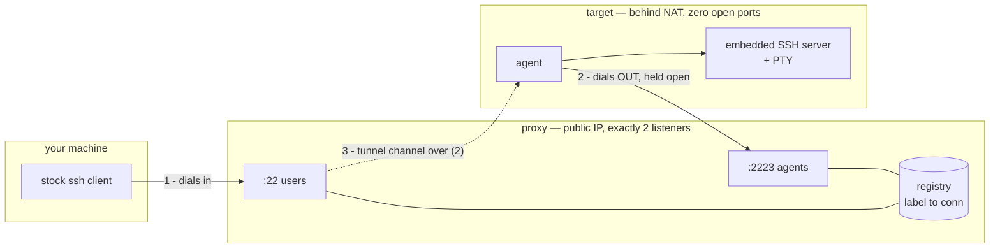
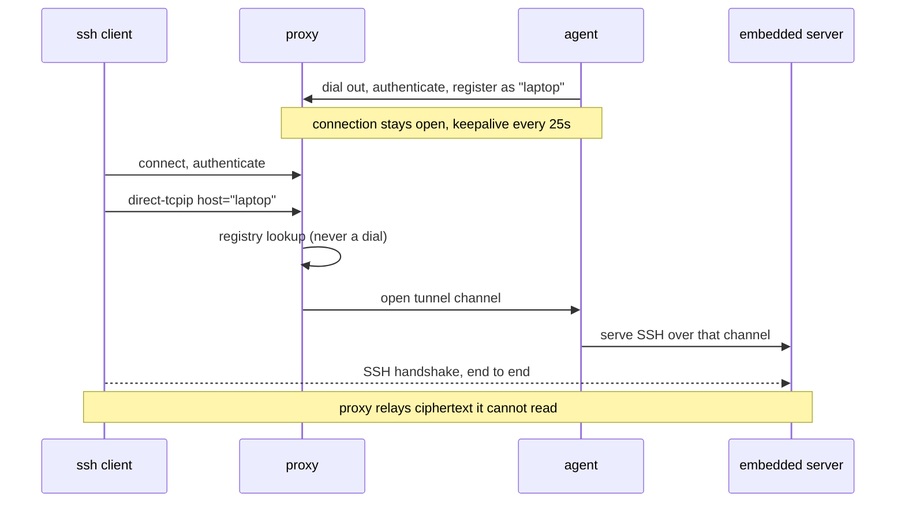

# multiSSH — reverse jump host

SSH into machines that cannot accept inbound connections. The target dials
*out* to a proxy and holds that connection open; you reach it by using the
proxy as a normal `ProxyJump` host, with a stock OpenSSH client and nothing
else installed on your side.

Built as a **tool of last resort** — for when Tailscale is down, the firewall
is hostile, or you locked yourself out of `sshd` with a bad config. That last
case is why the agent runs its **own** SSH server rather than forwarding to the
system one: a broken `sshd` on the target has no bearing on whether you can get
in.

> **Status: working prototype, in use on Linux and Windows. Internet exposure still lightly tested.**
> See [Security](#security) and [Known gaps](#known-gaps) before exposing it.
>
> The Python implementation this replaces is at the `v0-python` tag.
> `docs/spikes/` holds the throwaway programs that established *why* the design
> is shaped this way — chiefly that `ssh -L` and `ssh -J` are indistinguishable
> on the wire, and that closing one channel does not collapse the others.

---

## How it works



The trick is that `ssh -J proxy user@laptop` makes your client send the proxy a
`direct-tcpip` request naming `laptop` — **verbatim, without resolving it**. So
`laptop` is just a label the proxy looks up in its registry. The proxy then
opens a channel back down the agent's existing connection, and splices the two
together.



Because the inner handshake terminates at the agent, the proxy **cannot read
your session** and never learns which user you log in as. Three layers of
encryption end up on the proxy-to-agent wire: your session, inside the tunnel
channel, inside the agent's registration connection.

### Why no dynamic ports

Everything is multiplexed inside connections that already exist, so the proxy
opens exactly two listeners for its whole life and the target opens none.

---

## Using it

Build:

```bash
go build -o proxy ./cmd/proxy
go build -o agent ./cmd/agent
```

### Proxy

`users_authorized_keys` is a normal `authorized_keys` listing who may use the
proxy at all. There is no list of agents: they present certificates instead.

```bash
./proxy -user-addr :2022 -agent-addr 127.0.0.1:8080
```

The host key and CA key are generated on first run if absent. Agents connect
over a WebSocket, so bind that to loopback and let Caddy terminate TLS:

```caddyfile
multissh.example.com {
    reverse_proxy 127.0.0.1:8080
}
```

**This is tested against real Caddy**, with subdomain routing and another
service sharing the same port: registration, `exec`, an interactive PTY, 1 MB
of throughput and a 70-second idle session all work through it.

### Agent

```bash
./agent -proxy wss://multissh.example.com/agent

# or several, comma separated: the agent registers with all of them at once
./agent -proxy wss://multissh.example.com/agent,wss://backup.example.net/agent
```

`-proxy-host` overrides the HTTP `Host` header independently of the address
dialled, so a target can reach the proxy by IP when DNS is broken — a plausible
state of affairs for a last-resort tool.

On first run it generates an identity key and a host key. It then needs the
certificate issued by the proxy, the proxy's CA public key, and an
`agent_authorized_keys` holding the key you will log in with. It refuses to
start if its certificate does not match its own host key.

### Connecting

```bash
$ ssh proxy

 multiSSH proxy

 ONLINE (2)

   homeserver       homeserver.4kfq2wtnbxue       v1 current
       host key  SHA256:/XmRlLQzuatMnjzd87t4qacwiU+MNBNBwdkce60vTz4
       identity  SHA256:RJFA4HSiW9NQTFaJxSkTq1Zeu2dDIKpQIJjmO8yxe3Q
   rosa-maria-lapt  rosa-maria-lapt.2pw3653v75s3  v1 OUTDATED
       host key  SHA256:S24BJx1KW8bOzfIfTjNSByiP22NMpgLiJ3R/XpGwbtA
       identity  SHA256:A/i8701DJUjVoBfI04Ae16VrJBpXDLA7p/yWs8EUu3Y

 NOT CONNECTED (1)

   ! oldbox.7hs3kqp2mfxa   last seen 94d ago

   ! not seen in over 720h0m0s

 CONNECT

   ssh -J <thisproxy> user@homeserver

$ ssh -J proxy tizian@homeserver
tizian@target:~$
```

Each target shows **two different keys**, which is worth being clear about
because they are easy to confuse and only one of them is for verifying:

- **host key** — the target's SSH host key, the one your client checks. This is
  the string ssh prints on first connect, in exactly this format. Compare them,
  or paste it into ssh's `(yes/no/[fingerprint])` prompt and let ssh do it.
- **identity** — a different key, used to authenticate the agent *to the proxy*.
  It is the handle [`-revoke`](#revoking-a-machine) takes, and nothing else.

`v1` is the agent's protocol version, and `current`/`OUTDATED` says whether the
machine runs a binary this proxy still serves — see
[updating agents](#updating-agents).

### What you get on Windows

The agent runs as a scheduled task under **SYSTEM**, so the machine is
reachable before anyone logs in — which is the whole point for a rescue tool.
The shell you get is PowerShell running as SYSTEM, and that is a genuinely
different account from yours, not merely an elevated one:

- **No user profile.** `$HOME`, `%LOCALAPPDATA%` and `HKCU` are SYSTEM's, under
  `C:\Windows\System32\config\systemprofile`, not yours.
- **Per-user apps are missing.** `winget` in particular is an app execution
  alias in `%LOCALAPPDATA%\Microsoft\WindowsApps`, which is on *your* PATH and
  not on SYSTEM's — so it is "not recognized" in the session while working fine
  in your own PowerShell. The same goes for scoop, pyenv, and anything else
  installed per user.
- **No network identity of yours.** SYSTEM authenticates to other machines as
  the *computer* account, so mapped drives and shares behave differently.
- More privilege locally than an administrator, less reach outward.

If you would rather have a session as **yourself**, install a second agent in
user scope. Both can run side by side — the SYSTEM one is the rescue path, the
user one is the comfortable one, and they keep separate directories, keys and
scheduled tasks:

```powershell
# in a NORMAL (unelevated) PowerShell -- no flag needed
irm https://multissh.example.com/install.ps1 -OutFile $env:TEMP\ms.ps1
powershell -ExecutionPolicy Bypass -File $env:TEMP\ms.ps1
```

Scope follows elevation, as it does on Linux: an elevated shell installs for
the machine, anyone else installs for themselves. The confirmation prompt names
the scope it picked and why, so `-Scope` is only for overriding it — installing
for yourself *from* an elevated shell, say.

When the other scope is already installed, the suggested name avoids the one it
holds — `winbox-user` beside `winbox` — because both agents can ask for a
friendly name but only one can have it, and the loser is reachable under its
canonical name alone. The user-scope agent is **not reachable while you are
logged out**, which is the trade.

There is no `sudo -u` on Windows to switch between them from inside a session:
`runas` wants the password typed at a real console, and `Start-Process
-Credential` detaches the process so its output never comes back. Two agents is
the workable answer.

`whoami` says `nt authority\system`. To check what you are:

```powershell
whoami
[Security.Principal.WindowsIdentity]::GetCurrent().Name
([Security.Principal.WindowsPrincipal][Security.Principal.WindowsIdentity]::GetCurrent()
  ).IsInRole([Security.Principal.WindowsBuiltInRole]::Administrator)
```

For `winget` specifically, the package payload is present machine-wide even
though the alias is not, so it can be called by full path:

```powershell
$w = (Get-ChildItem 'C:\Program Files\WindowsApps' -Filter winget.exe -Recurse `
        -ErrorAction SilentlyContinue | Select-Object -First 1).FullName
& $w list
```

Microsoft does not support running `winget` as SYSTEM, and it may still fail on
source registration even when found. `--scope machine` installs are the ones
most likely to work. MSI installers and `Add-AppxProvisionedPackage` do not
have this problem.

**The username is ignored by both hops.** The proxy does not use it (the target
is chosen by hostname), and the agent's embedded server does not switch users —
it runs the shell as whoever the agent runs as. So `ssh -J proxy root@laptop`
on a user-scope install silently gives you a *non-root* shell. Write whatever
you like; only your key matters.

`scp` and `sftp` work, which matters because getting a file *off* a machine
that is half broken is a large part of what a rescue tool is for:

```bash
scp -J proxy user@laptop:/etc/ssh/sshd_config .     # rescue a file
sftp -J proxy user@laptop                           # or browse
```

Only the `sftp` subsystem is served; the embedded server is not a general
subsystem host. On Windows the files are reached as SYSTEM or as you,
[depending on scope](#what-you-get-on-windows).

---

## Security

### Trust model

The proxy is a **certificate authority**, but deliberately only for its own
business. It signs agent identities so it can authenticate them without
remembering anything, and it signs its own host key so agents can accept a
rebuilt proxy. It does **not** certify target host keys.

| Hop | Server identity | Who is allowed |
|---|---|---|
| you → proxy | host certificate signed by the CA (bare key also offered) | `users_authorized_keys` |
| agent → proxy | host certificate, agent pins the **CA** | identity certificate carrying the names |
| **you → target (E2E)** | **trust-on-first-use, proxy not involved** | agent's `agent_authorized_keys` |

**The proxy is not in the trust chain for your connections to targets**, and
that is on purpose. Were it to certify target host keys, a compromised proxy
could mint one for a machine it controls, route you there, and your client
would accept it in silence — pubkey auth would not leak your key, but you would
be typing into someone else's shell. Leaving targets on trust-on-first-use
means such a substitution trips the usual `HOST KEY CHANGED` warning.

A compromised proxy therefore cannot read your sessions, cannot log into your
machines, and cannot impersonate one to you. It can deny service.

### Two names per target

```
laptop.niwru7dfuvu5     canonical: derived from the target's own host key
laptop                  friendly: convenience, granted only when unclaimed
```

The canonical name embeds a hash of the target's host key **and of its own
label**, so it is unique by construction and needs no bookkeeping. More
usefully, **the name commits to the key your client verifies**: no other machine
can be given that name, because the string is derived from a key it does not
hold.

⚠️ The name's hash is **not** comparable by eye with what ssh prints. Both derive
from the same host key, but through different functions and different alphabets:

```
sha256(key)              base64  3kii8sLzg3y2UzY4nmFwhzllHFj7lwCUDA5EB83tesk   <- ssh prints this
sha256(domain|label|key) base32  p7tq2yx5krjg                                  <- the name uses this
```

To check the key on first connect, compare against the **host key** line in
`ssh proxy`, which is the same string in the same format ssh prints — or paste
it into ssh's `(yes/no/[fingerprint])` prompt and let ssh compare for you.

The label goes into the hash as well as in front of it. Hashing the host key
alone would leave the label free, so one machine could be presented under any
number of canonical names — each verifying perfectly — and `laptop` and
`backup-server` could be the same box with no way to tell.

Friendly names may not contain a dot; canonical names always do. That is the
whole of the namespace separation, so the two can never be confused.

The friendly name is the only ambiguous surface, so the proxy grants it only to
the machine that holds it, recorded in `friendly_labels`. A second machine
wanting the same name keeps its canonical name and the clash is logged rather
than silently resolved. That file is **advisory**: losing it costs a convenient
name, never access.

### Recovering the proxy

**Back up `proxy_ca_key` once.** Not after every enrollment — once, ever.

Rebuild the proxy on new hardware, restore that one file, and every target
reconnects on its own. A fresh host key is signed by the restored CA at
startup, so agents accept the replacement without being touched, and your own
`@cert-authority` line still matches. This is tested: the test deletes the
proxy's host key and every advisory record, restarts with only the CA key, and
watches the agent come back unaided *and be reachable*, not merely listed.

What each file costs you if it is lost:

| File | Losing it costs |
|---|---|
| `proxy_ca_key` | **everything** — every machine must be re-enrolled by hand |
| `revoked_keys` | **silently un-revokes every entry**; back this up too |
| `users_authorized_keys` | nothing you do not already have — your own public keys |
| `friendly_labels` | a convenient name, until the machine reconnects and reclaims it |
| `last_seen` | history, so decay is harder to notice for a while |
| `enrol_passwords.json` | the ability to enrol new machines until you make another |

```bash
# enrol a machine: the proxy signs its identity and derives its canonical
# name from its host key, storing nothing
./proxy -sign agent_identity.pub -sign-host-key agent_host_key.pub -sign-label laptop
./proxy -show-ca > proxy_ca.pub

# your known_hosts needs the authority only for the proxy itself; targets are
# pinned individually on first use, which is what keeps the proxy out of the
# trust chain
echo "@cert-authority multissh.example.com $(cat proxy_ca.pub)" >> ~/.ssh/known_hosts
```

Certificates never expire by default. For a rescue tool that is deliberate: a
machine switched off longer than its certificate lasts would otherwise lock
itself out. Use `-sign-validity` if you want expiry.

### Retiring a machine

Uninstalling the agent leaves the proxy holding two things about it: the
friendly name it claimed, and its place in the last-seen record.

```bash
multissh-proxy -forget winbox.bbbb        # canonical or friendly name
systemctl reload multissh-proxy
```

The name is the part that matters. **Reinstalling a machine generates a new
identity key**, the ledger still binds the name to the old one, and the machine
comes back reachable under its canonical name only — correct by the rules, and
baffling if you do not know the rules. Forget it first and the name is free
again.

This is housekeeping, not security: an uninstalled agent has no certificate
left to connect with. To bar a machine you do not physically control, use
[revocation](#revoking-a-machine).

### Revoking a machine

Because certificates do not expire, revocation is the only lever that removes a
machine's access, and the trade above is only honest if it works.

```bash
./proxy -revoke SHA256:2LnQxYd8… -revoke-note "stolen laptop"
./proxy -list-revoked
./proxy -unrevoke SHA256:2LnQxYd8…
```

The handle is the SHA256 fingerprint of the agent's **identity key**, shown by
`ssh proxy` and logged on every registration. Not the certificate serial:
fingerprints survive re-issuing a certificate, whereas serials would need a
name-to-serial map — exactly the growing state the certificate design removed.

A running proxy re-reads `revoked_keys` every 30 seconds and **drops matching
connections that are already established**, so revoking does not wait for the
machine to reconnect, and does not mean restarting the proxy and killing every
other session.

⚠️ **`revoked_keys` is the one file that is not advisory.** `friendly_labels`
and `last_seen` cost you a convenient name or some history; losing *this* one
silently un-revokes every entry. Back it up with `proxy_ca_key`. The file says
so in its own header.

⚠️ Revocation bars a **key**, not a machine. Anyone still holding a valid
enrolment password can enrol the same machine afresh under a new key. If the
hardware is genuinely out of your hands, `-remove-password` too.

### Verified by test

`go test ./...` runs everything below. The end-to-end tests build the real
proxy and agent binaries and run them over loopback, including a real PTY, so
they check the shipped programs rather than a rehearsal of them. `-short` skips
those and leaves the unit tests.

- `ssh -R` cannot make the proxy open a listening port
- `exec`, `subsystem`, X11 and agent forwarding are refused on the proxy
- an unregistered label is rejected
- **`ssh -L` reaches nothing** — routing is a map lookup, so the client-supplied
  host is never dialled and the client-supplied port is ignored. This matters:
  `-L` and `-J` are byte-identical on the wire, so that lookup *is* the
  security boundary, not merely routing
- a reconnecting agent cannot be deregistered by the ghost connection it
  replaced
- session teardown signals the shell's whole process group; no orphans after
  `kill -9` of the client
- the proxy survives being destroyed: with only `proxy_ca_key` restored and a
  brand new host key, the agent re-registers unaided
- a silent unauthenticated client is dropped after 30s, while an established
  session survives well past that
- a frozen agent (`SIGSTOP`) is evicted from the registry within ~30s, and a
  connection attempt to it fails in ~10s rather than hanging
- reconnect backoff resets after a healthy session, so recovery stays fast
- `sftp` and `scp` move files in both directions through the tunnel, while
  other subsystems stay refused
- the installer works over real TLS through real Caddy, end to end
- failed ssh handshakes are counted per source address and refused past a
  threshold, as `/enroll` attempts already were
- a revoked agent cannot register, and un-revoking lets it back in
- an agent below the configured protocol floor is refused, and is *told why* in
  its own log
- `/healthz` reports without naming a single target
- a withdrawn enrolment password stops working on reload, and a corrupt
  password file leaves the previous set in force rather than disabling
  enrolment outright
- publishing a new agent build and reloading with `SIGHUP` does not disconnect
  a single agent, and the listing flips to `OUTDATED`
- four regressions are frozen against their original shapes: rate-limit keys
  must strip the source port; `expected_hash` must exit zero when the platform
  is not the last entry; nothing may stop the agent before its binary is
  swapped; and the saved installer must re-fetch rather than compare against
  its own frozen version

The last two are there because both bugs were invisible in exactly the
configuration they were tested in — one build served, one request made — and
only appeared in the shape a real deployment takes.

### Before exposing it publicly

This has still only ever run on a LAN, against a single agent, on Linux. Treat
internet exposure as untested. Concretely, what is *not* there: no cap on
concurrent connections, and no per-user access control — any key in
`users_authorized_keys` reaches every registered target.

---

## Known gaps

| | Issue | Impact |
|---|---|---|
| 🔴 | The agent is **not code signed**. On Windows with Smart App Control enforced it can be blocked from starting, which shows up only as scheduled task result `0x800704C7` and an agent that never reconnects. | The installer strips the Mark of the Web and warns when Smart App Control is on. A real fix needs a code-signing certificate. |
| 🟡 | macOS is **built but never run**. | Unknown. Windows is now genuinely in use; macOS has never been started. |
| 🟡 | Windows: a machine-wide install is a real service; a user install is a scheduled task, because creating a service needs rights a user does not have. | The user-scope agent restarts three times on failure and stops when you log out. |
| 🟡 | `wss://` to a bare IP does not override TLS SNI, so `-proxy-host` alone is not enough to bypass DNS over TLS. | Works for `ws://` behind a TLS-terminating reverse proxy; direct `wss://` needs a resolvable name. |
| 🟡 | Processes a session starts survive disconnect, on both platforms. | Deliberate on Unix, as under a normal sshd. On Windows a Job Object would fix it, but it killed the self-update halfway through and had to come out; the way back is to move the restart out of the session. |
| 🟡 | Everyone with a user key reaches every target. No ACLs. | Fine for one operator; wrong the moment a second key is added for someone else. |
| 🟡 | Proxy configuration is entirely flags, held in the systemd unit. | `install-proxy.sh` writes the unit once and never overwrites it, so changes are edited on the server. |
| 🟡 | Agents are never updated automatically. | A sweep is something you run; nothing happens on its own. Deliberate — an automatic update that goes wrong takes out every machine at once. |
| ⚪ | A machine that enrolled but never once connected is invisible to the proxy — enrolment writes nothing there. | The installer reports success on the target instead. |

## Installing a target

The proxy serves a page at its own address with the install commands and a
button that copies them — worth having, because the machine you are installing
on is by definition one with no convenient way to get text onto it.


The proxy serves the installer and the agent builds itself. It has to be
reachable for the agent to work at all, so serving from it adds no failure mode
— and it can bake **its own authority into the script**, so the agent pins the
right one from its first connect and there is no trust-on-first-use window for
the agent-to-proxy hop.

```bash
# on the target
curl -fsSL https://multissh.example.com/install.sh | sudo sh          # linux, macos
irm https://multissh.example.com/install.ps1 | iex                    # windows, elevated
```

Re-running the installer on an enrolled machine updates it rather than
enrolling a second identity; `--reenroll` forces a fresh one.

It asks two things — the machine's name, defaulting to the hostname, and the
enrollment password — shows every path it will touch, and takes one
confirmation. Answering `c` walks each setting. Scope follows reality: root
installs system-wide, anyone else installs for themselves.

**Private keys are generated on the target and never transmitted.** Only public
halves are sent for signing, which is what keeps the proxy out of the trust
chain afterwards. Installation itself is the moment you trust the proxy, since
it serves the binary; that trust is bounded to that moment.

The script and a manifest of what it installed are saved beside the agent:

```bash
sh /var/lib/multissh-agent/manage.sh --update      # binary only; keys untouched
sh /var/lib/multissh-agent/manage.sh --rollback    # back to the previous binary
sh /var/lib/multissh-agent/manage.sh --uninstall
```

**These are safe to run over the tunnel itself**, which matters because for a
machine behind NAT that is the only way to reach it. See
[Updating agents](#updating-agents) for why that took some doing.

Piped from curl, options go after `--`:
`curl -fsSL … | sudo sh -s -- --uninstall`. Unattended installs read
`MULTISSH_PASSWORD` and friends, and the script detects the absence of a
terminal rather than hanging on a prompt.

### Managing enrolment passwords

```bash
multissh-proxy -passwords /var/lib/multissh/enrol_passwords.json -list-passwords
multissh-proxy -passwords ... -add-password laptops -password-validity 720h
multissh-proxy -passwords ... -remove-password laptops
systemctl reload multissh-proxy      # picks it up; no agent is disconnected
```

There is no "change" command: passwords are stored only as argon2id hashes, so
there is nothing to edit. Replace one by removing it and adding it again under
the same name. Names are create-only, and the clash is reported *before* you
are asked to type anything.

**The reload is not optional.** Passwords are held in memory, so until the
proxy re-reads the file a withdrawn password keeps working. Run it as root and
hand the file back: the password is read from your terminal and a service
account cannot open a terminal owned by you.

```bash
sudo multissh-proxy -passwords /var/lib/multissh/enrol_passwords.json -add-password laptops
sudo chown multissh:multissh /var/lib/multissh/enrol_passwords.json
sudo systemctl reload multissh-proxy
```

Passwords are argon2id-hashed with a lifetime chosen when created, `/enroll` is
rate limited, and enrolment writes nothing to the proxy — so none of this adds
anything to back up. A revoked identity key is refused at `/enroll` too, rather
than being handed a certificate that would then fail forever at connect time.

---

## Deploying the proxy

One command from your own machine, first time and every time after:

```bash
sh deploy/push.sh root@vps --public-url https://multissh.example.com   # first install
sh deploy/push.sh root@vps                                            # every update after
```

It builds all five platforms plus the proxy, ships them over ssh, and runs
`deploy/install-proxy.sh` on the far end, which creates the `multissh` system
user, the state directory and a hardened unit, then reports `/healthz`.

It finishes by reading `/healthz` and checking the `build` there against the
binary it just shipped, so a deployment is confirmed rather than assumed — a
command exiting zero is not evidence the new binary is the one running.

It is **safe to run against a live proxy**, and acts only on what changed:

| What changed | What happens |
|---|---|
| nothing | nothing |
| agent builds only | `systemctl reload` — **no agent loses its connection** |
| the proxy binary | a restart; agents reconnect on their own in a second or two |

The unit is written on first install and **never overwritten**, so flags you
edit on the server survive every later push. `install-proxy.sh` can also be run
by hand on the box; `push.sh` only builds, copies and calls it.

## Updating agents

```bash
sh deploy/update-agents.sh multissh          # every target reported OUTDATED
sh deploy/update-agents.sh multissh laptop   # just this one
sh deploy/update-agents.sh multissh --stop   # stop at the first failure
```

Every step is bounded and a machine that does not answer is **skipped**, not
allowed to stall the sweep — unreachable targets are the normal state for this
tool, not an exception. The run reports what it could not do and exits
non-zero. The command sent depends on the target's platform, which the agent
reports: a POSIX snippet pasted into PowerShell is not a graceful failure, it
is a page of parser errors and no update.

Targets are updated **one at a time**, waiting for each to come back before
touching the next, and stopping at the first failure. That ordering is the
point: an update that goes wrong on a rescue tool takes away the very thing you
would use to fix it, so the blast radius of a bad build has to be one machine.

`ssh proxy` marks each target `current` or `OUTDATED`, and `/healthz` counts
them. The agent hashes **its own executable** at startup and reports that, so
what you see is the binary a machine is really running rather than what someone
recorded at install time — the two drift apart the moment an update half
finishes.

### Why updating over the tunnel needed care

The installer used to stop the agent before moving the new binary into place.
Driven over the agent's own tunnel — which for a machine behind NAT is the only
way to reach it — that stop killed the update script too, because systemd tears
down the whole cgroup it was running in. The binary was never replaced, the
unit stayed stopped, and systemd would not restart it because it had been
stopped deliberately. **One update and the machine was gone for good.** This
was reproduced on a real systemd install, twice; `setsid` and `nohup` do not
help, as they escape the process-group kill but not the cgroup kill.

The stop was only there because a running executable cannot be overwritten in
place — `ETXTBSY`. But `rename(2)` has no such restriction: the running process
keeps its own inode and the new file simply takes the name. So the binary is
downloaded, verified, and swapped atomically, and *only then* is anything
restarted — by which point the update is already committed. If the script is
killed before that, the old agent is still running and the next restart picks
up the new binary. There is no window in which the machine has neither.

`--uninstall` is ordered the same way, for the same reason.

The outgoing binary is kept as `.prev`, so `--rollback` works, over the tunnel,
without the proxy.

Separately: the saved `manage.sh --update` could never update anything. The
proxy generates the installer per request with its current version baked in;
the saved copy froze that value and compared it against the manifest, which was
written from the same value. Always equal, so it reported `already current`
forever. It now asks the proxy for the script it is serving now — which it had
to reach anyway to download a binary from.

---

## Noticing decay

The realistic failure mode is not a breach. It is an agent that quietly stopped
months ago, discovered during the emergency it was meant to cover.

- `ssh proxy` lists machines it has seen before but that are **not connected
  now**, oldest first, and marks with `!` anything past `-stale-after`
  (30 days by default).
- The same warning is logged at proxy startup.
- `/healthz` on the agent listener answers monitoring:

```json
{"status":"ok","connected":3,"known":5,"stale":1,"stale_after":"720h0m0s","outdated":1,"revoked":0,"protocol":1,"build":"a4e9348d8d24"}
```

It is **unauthenticated and deliberately anonymous** — counts only, no names and
no fingerprints. It shares a public hostname with the installer, and which
machines exist is itself worth something to an attacker. Names live in the
authenticated listing.

## Protocol versioning

The agent runs on machines nobody touches; that is the entire point. So a
protocol change has to be something both ends can *see*, rather than something
that surfaces as an inexplicable failure months later.

- The version rides in the SSH identification string, exchanged before
  anything else. `-min-agent-protocol` refuses agents below a floor, and the
  proxy sends a **banner** saying so, which the agent prints to its own log —
  rather than leaving an unattributed authentication failure.
- The floor defaults to accepting everything, including agents installed before
  any of this existed. Refusing an old agent strands a machine, so that stays a
  decision taken deliberately rather than one a proxy upgrade makes for you.
- The tunnel channel carries a versioned payload with a reserved `Extra` field.
  New fields go *inside* it, because `ssh.Unmarshal` rejects a payload that does
  not match its struct exactly — so adding a field directly would break every
  agent already in the field. There is a test that fails if that ever stops
  being true.

---

## Standby proxies

Verifying a certificate needs only the authority's public key; issuing one
needs the private key. A standby therefore runs on the public half alone: it
authenticates every agent and can enrol nothing, so the private key stays on
one machine while access survives losing it.

```bash
# once, on the primary: certify the standby's host key
./proxy -sign-proxy-host standby_host_key.pub

# on the standby: no private authority material at all
./proxy -ca proxy_ca.pub -host-key standby_host_key -host-cert standby_host_key-cert.pub
```

Agents hold **one** certificate, valid at every proxy, and connect to all of
them at once rather than failing over — which costs a connection each and
removes any failover delay.

Your `known_hosts` needs no changes either: target entries are keyed by the
target's name, not the proxy, so the same pin works through either route.

Losing the primary costs you *enrolment*, not access. Every target stays
reachable through a standby while you rebuild, and adding new machines is the
thing that can wait.

⚠️ Put standbys on a different provider **and a different domain**. Two
subdomains of one zone share a registrar and a DNS provider, either of which
can take out both at once.

## Deployment behind a reverse proxy

The intended production shape, on a single VPS also hosting other services on
their own subdomains:

```
        :22   ─────────────────────────────►  multiSSH proxy (users)   direct, bypasses Caddy
VPS
        :443  ──►  Caddy  ──┬──  multissh.example.com  ──►  127.0.0.1:8080
                            ├──  other.example.com     ──►  another service
                            └──  …
```

The agent transport is a WebSocket (`wss://`), which is ordinary HTTP/1.1 with
an `Upgrade` header, so Caddy's `reverse_proxy` carries it natively and it looks
like plain HTTPS to any firewall or DPI in between. **Implemented and tested
against real Caddy.**

Note that **peeking at the first bytes to demux SSH and TLS on one port does
not work here** — Caddy owns `:443` and routes on TLS SNI, and raw SSH has no
SNI. That trick only applies if multiSSH owns the port outright.

Two properties this gains:

- The agent listener binds **loopback only** and is never directly exposed.
- Caddy terminates TLS but sees **only ciphertext**, because the SSH transport
  runs inside the WebSocket. Terminating TLS at the reverse proxy reveals
  nothing.

The user-facing SSH listener stays on `:22` and bypasses Caddy, since an `ssh`
client cannot speak through it. Putting the client side on `:443` too would
need a `ProxyCommand` helper, which breaks "stock ssh client, nothing extra".

---

## Development

```bash
sh deploy/check.sh       # everything CI runs, including shellcheck and pwsh
go test ./...            # unit tests plus end-to-end, ~20s
go test -short ./...     # unit tests only
sh deploy/build.sh dist  # every platform
```

Run `deploy/check.sh` before pushing. Two of CI's checks need tools that are on
neither a development machine nor the proxy — `shellcheck` and a PowerShell
parse — so they are easy to push and forget; that is exactly what happened, and
CI sat red for a day with the PowerShell check never running at all, because it
was ordered after the step that was failing. The script runs both through a
container, or says plainly that it skipped them.

Deployment lives in `deploy/`: `push.sh` (build and ship to the proxy host),
`install-proxy.sh` (run there, idempotent), `update-agents.sh` (roll a build
out to targets one at a time).

CI runs `gofmt`, `go vet`, `go test -race`, a cross-compile of all five
platforms, `sh -n` and `shellcheck` over the installer, and a PowerShell parse
check of `install.ps1` — the last of these because the Windows path has never
been run on real hardware, so a parse is the only guard it has.
