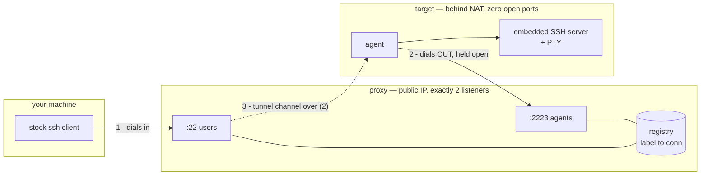
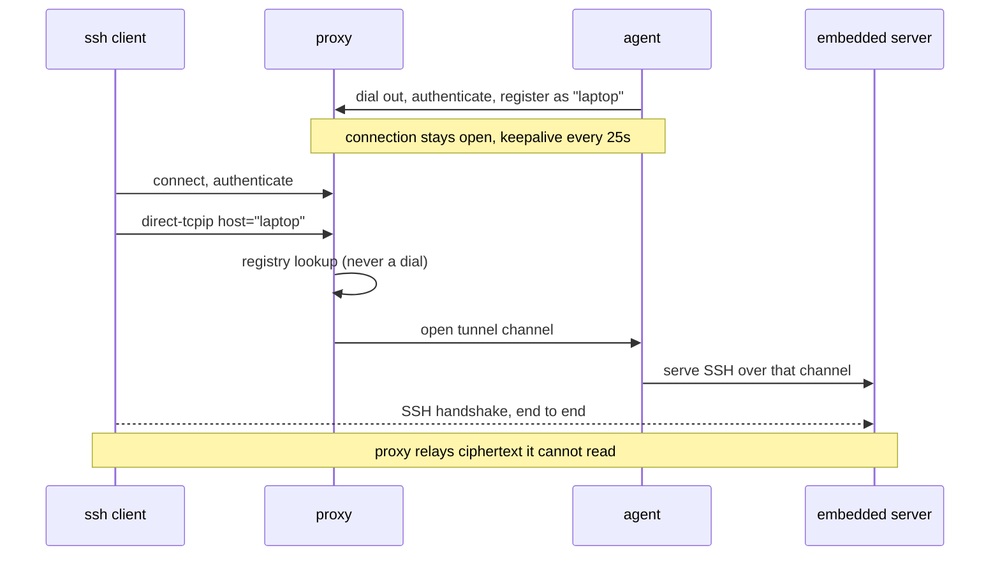

# multiSSH — reverse jump host

SSH into machines that cannot accept inbound connections. The target dials
*out* to a proxy and holds that connection open; you reach it by using the
proxy as a normal `ProxyJump` host, with a stock OpenSSH client and nothing
else installed on your side.

Built as a **tool of last resort** — for when Tailscale is down, the firewall
is hostile, or you locked yourself out of `sshd` with a bad config. That last
case is why the agent runs its **own** SSH server rather than forwarding to the
system one: a broken `sshd` on the target has no bearing on whether you can get
in.

> **Status: working prototype, in use on Linux, macOS and Windows. Internet exposure still lightly tested.**
> See [Security](docs/security.md) and [Known gaps](docs/security.md#known-gaps) before exposing it.
>
> The Python implementation this replaces is at the `v0-python` tag.
> `docs/spikes/` holds the throwaway programs that established *why* the design
> is shaped this way — chiefly that `ssh -L` and `ssh -J` are indistinguishable
> on the wire, and that closing one channel does not collapse the others.

---

## How it works



The trick is that `ssh -J proxy user@laptop` makes your client send the proxy a
`direct-tcpip` request naming `laptop` — **verbatim, without resolving it**. So
`laptop` is just a label the proxy looks up in its registry. The proxy then
opens a channel back down the agent's existing connection, and splices the two
together.



Because the inner handshake terminates at the agent, the proxy **cannot read
your session** and never learns which user you log in as. Three layers of
encryption end up on the proxy-to-agent wire: your session, inside the tunnel
channel, inside the agent's registration connection.

### Why no dynamic ports

Everything is multiplexed inside connections that already exist, so the proxy
opens exactly two listeners for its whole life and the target opens none.

---

## Using it

Build:

```bash
go build -o proxy ./cmd/proxy
go build -o agent ./cmd/agent
```

### Proxy

`users_authorized_keys` is a normal `authorized_keys` listing who may use the
proxy at all. There is no list of agents: they present certificates instead.

```bash
./proxy -user-addr :2022 -agent-addr 127.0.0.1:8080
```

The host key and CA key are generated on first run if absent. Agents connect
over a WebSocket, so bind that to loopback and let Caddy terminate TLS:

```caddyfile
multissh.example.com {
    reverse_proxy 127.0.0.1:8080
}
```

**This is tested against real Caddy**, with subdomain routing and another
service sharing the same port: registration, `exec`, an interactive PTY, 1 MB
of throughput and a 70-second idle session all work through it.

### Agent

```bash
./agent -proxy wss://multissh.example.com/agent

# or several, comma separated: the agent registers with all of them at once
./agent -proxy wss://multissh.example.com/agent,wss://backup.example.net/agent
```

`-proxy-host` overrides the HTTP `Host` header independently of the address
dialled, so a target can reach the proxy by IP when DNS is broken — a plausible
state of affairs for a last-resort tool.

On first run it generates an identity key and a host key. It then needs the
certificate issued by the proxy, the proxy's CA public key, and an
`agent_authorized_keys` holding the key you will log in with. It refuses to
start if its certificate does not match its own host key.

### Connecting

```bash
$ ssh proxy

 multiSSH proxy

 ONLINE (2)

   homeserver       homeserver.4kfq2wtnbxue       v1 current
       host key  SHA256:/XmRlLQzuatMnjzd87t4qacwiU+MNBNBwdkce60vTz4
       identity  SHA256:RJFA4HSiW9NQTFaJxSkTq1Zeu2dDIKpQIJjmO8yxe3Q
   laptop           laptop.2pw3653v75s3           v1 OUTDATED
       host key  SHA256:S24BJx1KW8bOzfIfTjNSByiP22NMpgLiJ3R/XpGwbtA
       identity  SHA256:A/i8701DJUjVoBfI04Ae16VrJBpXDLA7p/yWs8EUu3Y

 NOT CONNECTED (1)

   ! oldbox.7hs3kqp2mfxa   last seen 94d ago

   ! not seen in over 720h0m0s

 CONNECT

   ssh -J <thisproxy> user@homeserver

$ ssh -J proxy you@homeserver
you@target:~$
```

Each target shows **two different keys**, which is worth being clear about
because they are easy to confuse and only one of them is for verifying:

- **host key** — the target's SSH host key, the one your client checks. This is
  the string ssh prints on first connect, in exactly this format. Compare them,
  or paste it into ssh's `(yes/no/[fingerprint])` prompt and let ssh do it.
- **identity** — a different key, used to authenticate the agent *to the proxy*.
  It is the handle [`-revoke`](docs/security.md#revoking-a-machine) takes, and nothing else.

`v1` is the agent's protocol version, and `current`/`OUTDATED` says whether the
machine runs a binary this proxy still serves — see
[updating agents](docs/operations.md#updating-agents).

---

## Documentation

The detail lives in `docs/`, so this page stays an overview:

| | |
|---|---|
| [docs/security.md](docs/security.md) | Trust model, what is verified by test and what is only checked by hand, revoking and retiring machines, and the **known gaps** |
| [docs/operations.md](docs/operations.md) | Installing targets, deploying the proxy, updating agents, changing who can log in, standbys, running behind a reverse proxy |
| [docs/windows.md](docs/windows.md) | What an install gives you on Windows, and how the two scopes differ |
| [docs/development.md](docs/development.md) | Building, the checks CI runs, protocol versioning |
| [docs/design-notes.md](docs/design-notes.md) | Why a few things are shaped the way they are |
