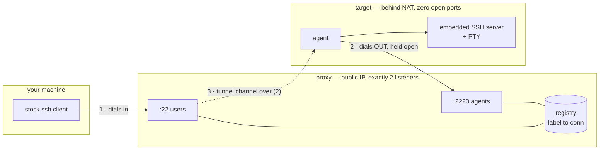
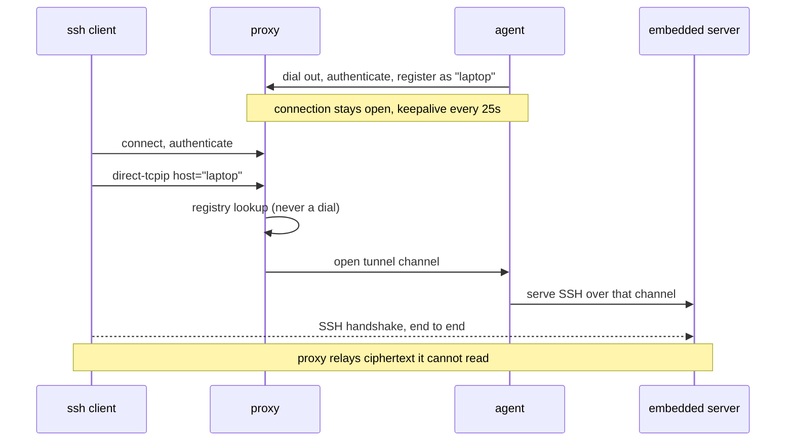

# multiSSH — reverse jump host

SSH into machines that cannot accept inbound connections. The target dials
*out* to a proxy and holds that connection open; you reach it by using the
proxy as a normal `ProxyJump` host, with a stock OpenSSH client and nothing
else installed on your side.

Built as a **tool of last resort** — for when Tailscale is down, the firewall
is hostile, or you locked yourself out of `sshd` with a bad config. That last
case is why the agent runs its **own** SSH server rather than forwarding to the
system one: a broken `sshd` on the target has no bearing on whether you can get
in.

> **Status: working prototype, Linux only. Reliability gaps closed; internet exposure still untested.**
> See [Security](#security) and [Known gaps](#known-gaps) before exposing it.

---

## How it works



The trick is that `ssh -J proxy user@laptop` makes your client send the proxy a
`direct-tcpip` request naming `laptop` — **verbatim, without resolving it**. So
`laptop` is just a label the proxy looks up in its registry. The proxy then
opens a channel back down the agent's existing connection, and splices the two
together.



Because the inner handshake terminates at the agent, the proxy **cannot read
your session** and never learns which user you log in as. Three layers of
encryption end up on the proxy-to-agent wire: your session, inside the tunnel
channel, inside the agent's registration connection.

### Why no dynamic ports

Everything is multiplexed inside connections that already exist, so the proxy
opens exactly two listeners for its whole life and the target opens none.

---

## Using it

Build:

```bash
go build -o proxy ./cmd/proxy
go build -o agent ./cmd/agent
```

### Proxy

Needs two files. `users_authorized_keys` is a normal `authorized_keys` listing
who may use the proxy at all. `agents_authorized_keys` maps each target's key
to the label it will be known by — **the proxy assigns labels, so an agent
cannot claim one belonging to another key**:

```
# agents_authorized_keys
laptop     ssh-ed25519 AAAAC3Nza...  agent_identity
homeserver ssh-ed25519 AAAAC3Nza...  agent_identity
```

```bash
./proxy -user-addr :22 -agent-addr :2223
```

The host key is generated on first run if absent.

Enable the WebSocket listener to run behind a reverse proxy. Bind it to
loopback and let Caddy terminate TLS:

```bash
./proxy -user-addr :22 -agent-addr "" -agent-ws-addr 127.0.0.1:8080
```

```caddyfile
multissh.example.com {
    reverse_proxy 127.0.0.1:8080
}
```

**This is tested against real Caddy**, with subdomain routing and another
service sharing the same port: registration, `exec`, an interactive PTY, 1 MB
of throughput and a 70-second idle session all work through it.

### Agent

```bash
./agent -proxy proxy.example.com:2223               # raw TCP
./agent -proxy wss://multissh.example.com/agent     # through a reverse proxy
```

`-proxy-host` overrides the HTTP `Host` header independently of the address
dialled, so a target can reach the proxy by IP when DNS is broken — a plausible
state of affairs for a last-resort tool.

On first run it generates three things: an identity key (proving itself to the
proxy), a host key for its embedded server, and — on first connect — a pinned
copy of the proxy's host key. It needs `agent_authorized_keys` containing the
key you will log in with.

### Connecting

```bash
$ ssh proxy
 multiSSH proxy

 registered targets (2):

   homeserver
   laptop

 connect with:  ssh -J proxy user@laptop

$ ssh -J proxy tizian@laptop
tizian@target:~$
```

`scp`/`sftp` do **not** work yet — the embedded server serves interactive
sessions and `exec` only.

---

## Security

### Trust model

Host keys are trust-on-first-use; authorization keys are always explicit.

| Hop | Server identity | Who is allowed |
|---|---|---|
| you → proxy | proxy host key, TOFU into your `known_hosts` | `users_authorized_keys` |
| agent → proxy | proxy host key, TOFU into `known_proxy_key` | `agents_authorized_keys`, with the label |
| you → target (E2E) | embedded host key, TOFU as the label | agent's `agent_authorized_keys` |

The target's own `authorized_keys` is the real authority. A **fully compromised
proxy still cannot log into any target**, because it does not hold your private
key — it can only route bytes, and it cannot read them.

### Verified by test

- `ssh -R` cannot make the proxy open a listening port
- `exec`, `subsystem`, X11 and agent forwarding are refused on the proxy
- an unregistered label is rejected
- **`ssh -L` reaches nothing** — routing is a map lookup, so the client-supplied
  host is never dialled and the client-supplied port is ignored. This matters:
  `-L` and `-J` are byte-identical on the wire, so that lookup *is* the
  security boundary, not merely routing
- a reconnecting agent cannot be deregistered by the ghost connection it
  replaced
- session teardown signals the shell's whole process group; no orphans after
  `kill -9` of the client
- a silent unauthenticated client is dropped after 30s, while an established
  session survives well past that
- a frozen agent (`SIGSTOP`) is evicted from the registry within ~30s, and a
  connection attempt to it fails in ~10s rather than hanging
- reconnect backoff resets after a healthy session, so recovery stays fast

### Before exposing it publicly

The denial-of-service and liveness gaps are closed, but this has still only
ever run on a LAN, against a single agent, on Linux. Treat internet exposure as
untested. There is no rate limiting on repeated failed authentication, and no
cap on concurrent connections.

---

## Known gaps

| | Issue | Impact |
|---|---|---|
| 🟡 | Windows and macOS are **built but never run**. | Unknown. |
| 🟡 | No `sftp`/`scp`. | No file recovery. |
| 🟡 | `wss://` to a bare IP does not override TLS SNI, so `-proxy-host` alone is not enough to bypass DNS over TLS. | Works for `ws://` behind a TLS-terminating reverse proxy; direct `wss://` needs a resolvable name. |
| 🟡 | Backgrounded jobs (`cmd &`) survive disconnect, as they do under a normal sshd. Windows also does not reap processes the shell itself spawned. | Deliberate on Unix; a Job Object is the proper Windows fix. |
| ⚪ | No installer. Enrollment is manual: paste the agent's public key into the proxy's config. | See below. |

### On a one-line installer

A `curl … | sh` installer can drop the binary, generate keys, pre-seed the
proxy's host key and install a service unit — but it **cannot finish enrollment
on its own**, because the proxy must already know the agent's public key before
it will accept the connection.

Manual enrollment (paste the printed public key into `agents_authorized_keys`)
is what works today. The design below is what it should become.

---

## Deployment behind a reverse proxy

The intended production shape, on a single VPS also hosting other services on
their own subdomains:

```
        :22   ─────────────────────────────►  multiSSH proxy (users)   direct, bypasses Caddy
VPS
        :443  ──►  Caddy  ──┬──  multissh.example.com  ──►  127.0.0.1:8080
                            ├──  other.example.com     ──►  another service
                            └──  …
```

The agent transport is a WebSocket (`wss://`), which is ordinary HTTP/1.1 with
an `Upgrade` header, so Caddy's `reverse_proxy` carries it natively and it looks
like plain HTTPS to any firewall or DPI in between. **Implemented and tested
against real Caddy.**

Note that **peeking at the first bytes to demux SSH and TLS on one port does
not work here** — Caddy owns `:443` and routes on TLS SNI, and raw SSH has no
SNI. That trick only applies if multiSSH owns the port outright.

Two properties this gains:

- The agent listener binds **loopback only** and is never directly exposed.
- Caddy terminates TLS but sees **only ciphertext**, because the SSH transport
  runs inside the WebSocket. Terminating TLS at the reverse proxy reveals
  nothing.

The user-facing SSH listener stays on `:22` and bypasses Caddy, since an `ssh`
client cannot speak through it. Putting the client side on `:443` too would
need a `ProxyCommand` helper, which breaks "stock ssh client, nothing extra".

## Planned: enrollment

Adding a machine has to be nearly frictionless, or it does not get done.

The proxy serves the installer itself, so `install.sh` is generated per request
with **the proxy's own SSH host key fingerprint baked in**. The agent then pins
the right key on its very first connect, and the trust-on-first-use window
disappears entirely — anchored on the Caddy TLS certificate instead.

```
curl https://multissh.example.com/install.sh | sh
```

**Naming.** Prompt for a label, defaulting to the machine's hostname, Enter to
accept. If that label is already registered, the proxy assigns a variant rather
than failing — `laptop-2`, or a short random suffix like `laptop-6sk2`. Never
silently replace an existing registration.

**Credential.** A password registered with the proxy ahead of time, each with
its own **configurable longevity** — a long-lived one for convenience, or a
short-lived one when handing a machine to someone else. Requirements:

- stored as an argon2id hash, never plaintext
- `/enroll` rate-limited, or it is a brute-force oracle
- create-only: enrollment may never overwrite an existing label

**Enrollment window: optional, off by default.** A deliberately opened window
is the stricter option, but it adds friction to the operation that most needs
to stay easy. Password longevity already time-boxes the risk. Worth having as
an opt-in for anyone who wants it.

**Later: browser approval.** The appealing version is a page on the same
domain, already authenticated on phone or desktop, where a pending enrollment
is approved with one button. Best security *and* the least friction, but it
needs a session/auth story of its own, so it comes after the password flow.

⚠️ Implementation note: with `curl … | sh`, stdin is the script itself, so a
plain `read` gets EOF. The prompt must read the terminal directly:

```sh
printf 'Enrollment password: '
read -rs PASSWORD < /dev/tty
```

PowerShell's `iex (irm …)` is unaffected; `Read-Host` works normally.
