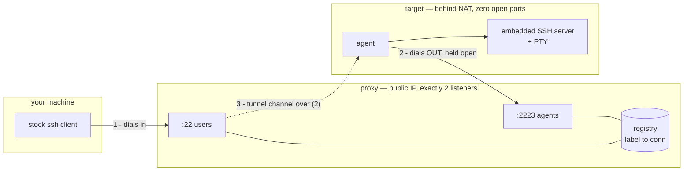
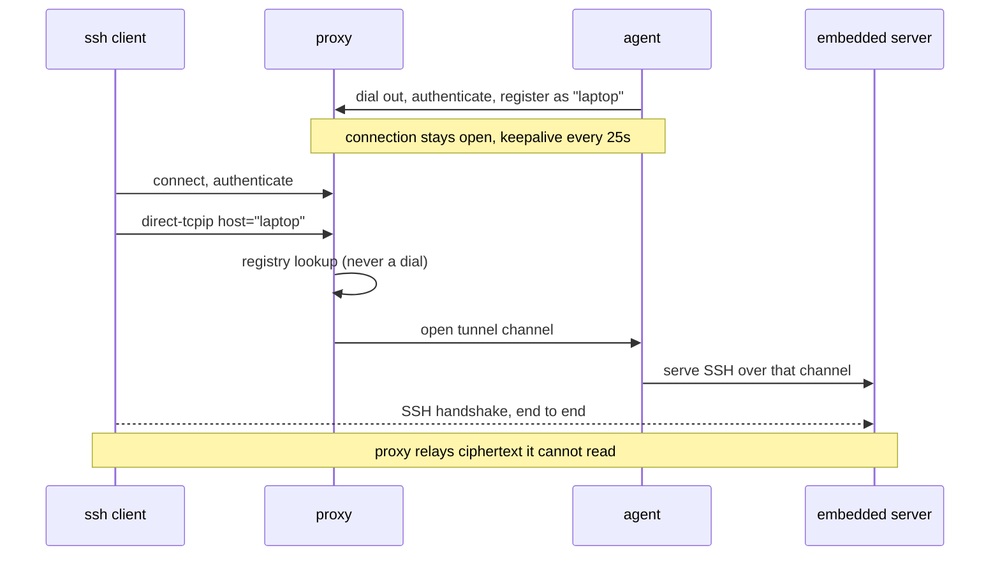

# multiSSH — reverse jump host

SSH into machines that cannot accept inbound connections. The target dials
*out* to a proxy and holds that connection open; you reach it by using the
proxy as a normal `ProxyJump` host, with a stock OpenSSH client and nothing
else installed on your side.

Built as a **tool of last resort** — for when Tailscale is down, the firewall
is hostile, or you locked yourself out of `sshd` with a bad config. That last
case is why the agent runs its **own** SSH server rather than forwarding to the
system one: a broken `sshd` on the target has no bearing on whether you can get
in.

> **Status: working prototype, Linux only, not internet-ready.**
> See [Security](#security) and [Known gaps](#known-gaps) before exposing it.

---

## How it works



The trick is that `ssh -J proxy user@laptop` makes your client send the proxy a
`direct-tcpip` request naming `laptop` — **verbatim, without resolving it**. So
`laptop` is just a label the proxy looks up in its registry. The proxy then
opens a channel back down the agent's existing connection, and splices the two
together.



Because the inner handshake terminates at the agent, the proxy **cannot read
your session** and never learns which user you log in as. Three layers of
encryption end up on the proxy-to-agent wire: your session, inside the tunnel
channel, inside the agent's registration connection.

### Why no dynamic ports

Everything is multiplexed inside connections that already exist, so the proxy
opens exactly two listeners for its whole life and the target opens none.

---

## Using it

Build:

```bash
go build -o proxy ./cmd/proxy
go build -o agent ./cmd/agent
```

### Proxy

Needs two files. `users_authorized_keys` is a normal `authorized_keys` listing
who may use the proxy at all. `agents_authorized_keys` maps each target's key
to the label it will be known by — **the proxy assigns labels, so an agent
cannot claim one belonging to another key**:

```
# agents_authorized_keys
laptop     ssh-ed25519 AAAAC3Nza...  agent_identity
homeserver ssh-ed25519 AAAAC3Nza...  agent_identity
```

```bash
./proxy -user-addr :22 -agent-addr :2223
```

The host key is generated on first run if absent.

### Agent

```bash
./agent -proxy proxy.example.com:2223
```

On first run it generates three things: an identity key (proving itself to the
proxy), a host key for its embedded server, and — on first connect — a pinned
copy of the proxy's host key. It needs `agent_authorized_keys` containing the
key you will log in with.

### Connecting

```bash
$ ssh proxy
 multiSSH proxy

 registered targets (2):

   homeserver
   laptop

 connect with:  ssh -J proxy user@laptop

$ ssh -J proxy tizian@laptop
tizian@target:~$
```

`scp`/`sftp` do **not** work yet — the embedded server serves interactive
sessions and `exec` only.

---

## Security

### Trust model

Host keys are trust-on-first-use; authorization keys are always explicit.

| Hop | Server identity | Who is allowed |
|---|---|---|
| you → proxy | proxy host key, TOFU into your `known_hosts` | `users_authorized_keys` |
| agent → proxy | proxy host key, TOFU into `known_proxy_key` | `agents_authorized_keys`, with the label |
| you → target (E2E) | embedded host key, TOFU as the label | agent's `agent_authorized_keys` |

The target's own `authorized_keys` is the real authority. A **fully compromised
proxy still cannot log into any target**, because it does not hold your private
key — it can only route bytes, and it cannot read them.

### Verified by test

- `ssh -R` cannot make the proxy open a listening port
- `exec`, `subsystem`, X11 and agent forwarding are refused on the proxy
- an unregistered label is rejected
- **`ssh -L` reaches nothing** — routing is a map lookup, so the client-supplied
  host is never dialled and the client-supplied port is ignored. This matters:
  `-L` and `-J` are byte-identical on the wire, so that lookup *is* the
  security boundary, not merely routing
- a reconnecting agent cannot be deregistered by the ghost connection it
  replaced
- session teardown signals the shell's whole process group; no orphans after
  `kill -9` of the client

### Not safe to expose yet

See [Known gaps](#known-gaps) — chiefly no handshake timeout, which makes the
proxy trivially DoS-able by an unauthenticated client.

---

## Known gaps

| | Issue | Impact |
|---|---|---|
| 🔴 | **No handshake timeout on either listener.** A client that connects and never speaks holds a goroutine and socket forever. | Unauthenticated DoS. OpenSSH's `LoginGraceTime` exists for this. |
| 🔴 | **Proxy does not detect dead agents promptly.** It only notices via `conn.Wait()`, so a half-open TCP (sleeping laptop) leaves a ghost registration until the kernel gives up, which can be many minutes. | Stale target in the listing; connections to it hang. |
| 🟠 | **`OpenChannel` toward an agent has no timeout.** | A user's `ssh -J` hangs instead of failing fast. |
| 🟠 | **Reconnect backoff never resets after a successful session.** It only ever doubles, so a long-lived agent that has disconnected a few times ends up permanently waiting the 60s maximum. | Slower recovery exactly when it matters. |
| 🟡 | Windows and macOS are **built but never run**. | Unknown. |
| 🟡 | No `sftp`/`scp`. | No file recovery. |
| 🟡 | Agent-to-proxy transport is plain TCP on a custom port. | Blocked by restrictive firewalls; TLS/WebSocket on 443 would fix it. |
| 🟡 | Backgrounded jobs (`cmd &`) survive disconnect, as they do under a normal sshd. Windows also does not reap processes the shell itself spawned. | Deliberate on Unix; a Job Object is the proper Windows fix. |
| ⚪ | No installer. Enrollment is manual: paste the agent's public key into the proxy's config. | See below. |

### On a one-line installer

A `curl … | sh` installer can drop the binary, generate keys, pre-seed the
proxy's host key and install a service unit — but it **cannot finish enrollment
on its own**, because the proxy must already know the agent's public key before
it will accept the connection. Two ways out:

1. **Manual (today).** The installer prints the agent's public key; you paste it
   into `agents_authorized_keys` with a label. Two steps, no new attack surface.
2. **Enrollment token.** The proxy issues a short-lived token, and
   `curl … | sh -s -- --token ABC123` self-registers. One step, but the proxy
   needs a token endpoint, token storage and expiry — and that endpoint becomes
   a new thing to secure.

Option 2 is the UX you want eventually; option 1 is right until the reliability
gaps above are closed.
